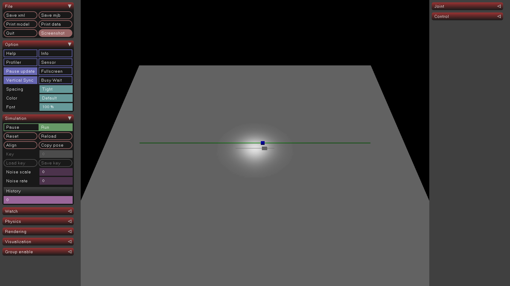
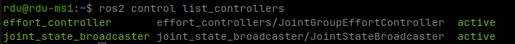
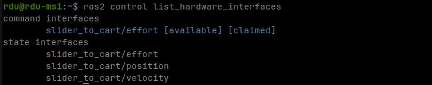
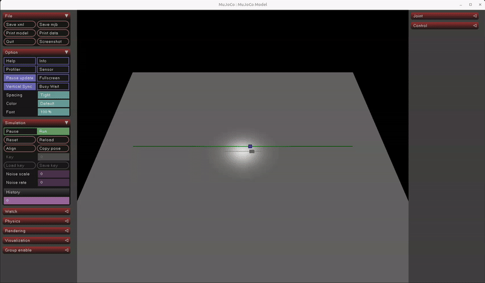

# Mujoco Simulate App with ROS2 Integration


This package utilizes the [pluginlib](https://github.com/ros/pluginlib) to make the [
`simulate`](https://github.com/google-deepmind/mujoco/tree/main/simulate) app from mujoco easily extendable. With this
plugin support, [mujoco_ros2_control](https://github.com/rxdu/mujoco_ros2_control) is integrated to enable a flexible
control interface of the simulated robot and sensors with the ros2_control framework.

You can use this package together with the [mujoco_ros2_control](https://github.com/rxdu/mujoco_ros2_control) package to
get a similar setup as the [gz_ros2_control](https://github.com/ros-controls/gz_ros2_control) package for Gazebo.

The following environment and software versions are supported and regularly tested:

* Ubuntu 24.04
* ROS2 Jazzy
* Mujoco 3.2.7

## Build the packages

It's recommended to clone and build the `mujoco_demo_robot` package to get a working example of the simulation setup.
The demo robot model `test_cart.xml` is defined in `mujoco_ros2_control` and the `mujoco_demo_robot` package
demonstrates how to start the simulation as well as the ros2 controllers.

```bash
cd <colcon-ws>/src
git clone -b 3.2.7 https://github.com/google-deepmind/mujoco.git
git clone https://github.com/rxdu/mujoco_sim_ros2.git
git clone https://github.com/rxdu/mujoco_ros2_control.git
git clone https://github.com/rxdu/mujoco_demo_robot.git
cd <colcon-ws>
colcon build --symlink-install
```

Now you can start the simulation with the demo robot.

```bash
ros2 launch mujoco_demo_robot cart_effort.launch.py
```



You can check the ros2_control setup by listing available hardware and controllers:




You can test the controller by sending a command to the effort controller:

```bash
ros2 run mujoco_ros2_control_demos example_effort
```


